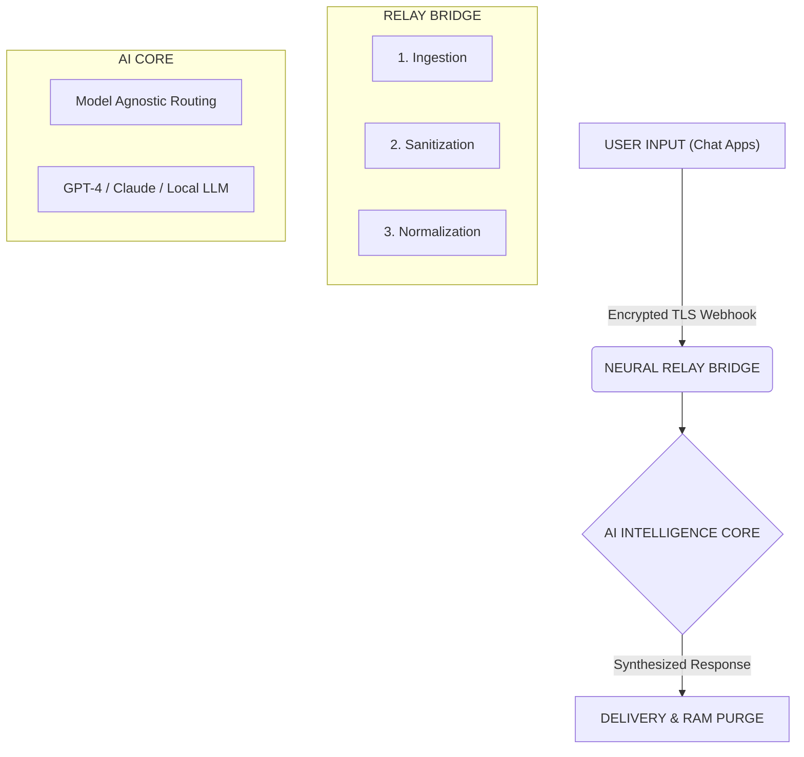

# ILLUMINATION PRO: Unified Neural Grid Protocol
**Next-Generation API Gateway for Autonomous Chat Intelligence**

> **CONFIDENTIAL // WHITE PAPER // VERSION 1.0**

---

## 01. Abstract

As AI models become increasingly powerful, the bridge between human communication platforms (WhatsApp, Telegram, Discord, etc.) and synthetic intelligence remains fragmented. Traditional solutions rely heavily on local device orchestration, creating bottlenecks in scalability, reliability, and security.

**ILLUMINATION PRO** introduces a server-side, cloud-native architecture that eliminates device dependency, offering a stable API layer for automated replies and neural processing without risking local hardware integrity.

---

## 02. Inspiration & Evolution

Our journey began with deep admiration for **OpenClaw**, a pioneering project that successfully integrated chat platforms with AI capabilities. OpenClaw demonstrated the immense potential of bridging conversational interfaces with large language models.

> *"Inspired by OpenClaw's vision of seamless AI integration, we recognized the need to evolve from local execution to enterprise-grade cloud reliability."*

While local-first approaches like OpenClaw offer privacy benefits, they introduce significant operational risks:
- High CPU/GPU load on consumer devices, leading to overheating and battery drain.
- Unstable network connections causing missed messages or delayed responses.
- Risk of "control damage" where automated scripts clash with user input, potentially flagging accounts or crashing the OS.

---

## 03. The ILLUMINATION Solution

ILLUMINATION PRO shifts the paradigm by offering a **managed API service**. Instead of running heavy Python scripts or Node.js servers on your personal laptop or phone, you simply connect your accounts to our Neural Grid.

### Cloud-Native Stability
Our servers handle the heavy lifting. Your device remains cool, and your battery life is preserved. 99.9% uptime for your automated replies.

### Risk Mitigation
Advanced rate-limiting and anti-ban heuristics prevent account striction. No "stuck" loops that damage local control flows.

Users gain access to a powerful REST/WebSocket API, allowing them to define custom logic, switch between AI models (GPT-4, Claude 3, DeepSeek, etc.), and manage multiple channels from a single dashboard—all without a single installation on their end device.

---

## 04. Technical Architecture

The ILLUMINATION Protocol leverages the Solana blockchain for decentralized access control and transparent usage tracking.

- **Relay Bridge:** Securely tunnels messages from platforms (WhatsApp, Telegram) to our Neural Core.
- **Neural Core:** Dynamic router that sends prompts to the best-suited AI model based on context and cost.
- **Safety Layer:** Real-time filtering to prevent hallucinations and unsafe content generation.

### 04.1 Data Processing Schema

To ensure maximum security and efficiency, data flows through a strict, unidirectional pipeline. We do not store conversation logs.

---

## 05. Conclusion

By moving the intelligence layer to the cloud, ILLUMINATION PRO offers a safer, more robust alternative to local automation tools. We honor the path paved by innovators like OpenClaw but take a definitive step towards a future where AI integration is effortless, invisible, and infinitely scalable.

---

**© 2026 ILLUMINATION AI LABS. ALL RIGHTS RESERVED.**
**SECURED BY SOLANA NETWORK.**
